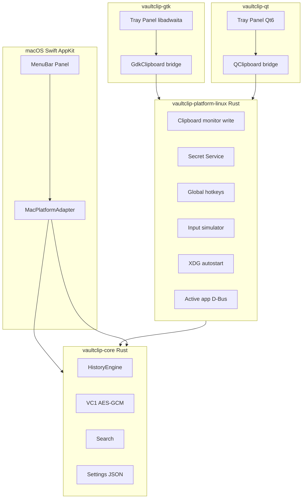
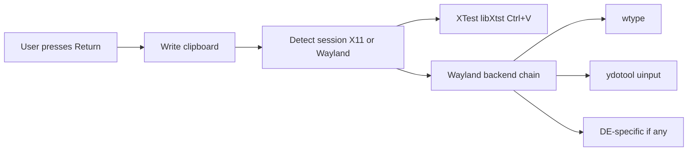

# План портирования VaultClip на Linux

**Статус:** черновик дорожной карты  
**Стратегия:** общее ядро на Rust + два Linux-клиента (GTK 4 и Qt 6); macOS остаётся на Swift/AppKit  
**Цель:** паритет функций с macOS, включая auto-paste на X11 и Wayland (с оговорками по compositor)

---

## Исходная точка

Текущий `VaultClip/` — **~82 из 121** Swift-файлов завязаны на AppKit/Cocoa. «Ядро» истории **не выделено**: даже `HistoryFileManager.swift` и `HistoryItem.swift` используют `NSPasteboard`, Keychain и `NSWorkspace`.

Переносимый **контракт** (общий для macOS, GTK и Qt):

- формат каталога `history/<UUID>/` + файлы метаданных (`favorite`, `password`, `copiedAt`, …);
- `order.xml` / plist порядка UUID;
- шифрование **VC1** + AES-256-GCM (`DataFileManager.swift`, `AESGCMDataEncryptor.swift`);
- правила dedup, pruning, favorites/passwords (`History.swift`);
- fuzzy search (`Search.swift`, `SearchEngine.swift`).

**Важно:** ключ из macOS Keychain **не переносится** на Linux — нужен отдельный импорт/экспорт или общий файл ключа (опционально, с предупреждением).

---

## Выбранная архитектура: два Linux-клиента

Один **Rust core** + один **Linux platform layer** (без привязки к UI-тулкиту) + **два независимых UI**:

| Клиент | Стек | Аудитория | Бинарник |
|--------|------|-----------|----------|
| **vaultclip-gtk** | GTK 4 + libadwaita + StatusNotifier | GNOME, elementary, Xfce (частично) | `vaultclip-gtk` |
| **vaultclip-qt** | Qt 6 Widgets | KDE, кросс-DE, пользователи CopyQ-подобного UX | `vaultclip-qt` |

Оба клиента вызывают **одни и те же** `vaultclip-core` и `vaultclip-platform-linux`. Различается только слой отрисовки и привязка clipboard к тулкиту на границе.



**Почему Rust для core и platform:** GTK и Qt не дублируют clipboard/secrets/input — только тонкий **clipboard bridge** (чтение/запись MIME в каждом UI).

**Порядок реализации UI:** сначала **GTK** (референс для GNOME, меньше лицензионных вопросов в дистрибутивах), затем **Qt** (переиспользование UX-спеки и тест-кейсов). Параллельная разработка возможна после фазы 1–2.

---

## Сравнение GTK vs Qt (одинаковый функционал)

| Компонент macOS | GTK 4 | Qt 6 |
|-----------------|-------|------|
| Menu bar / tray | `GtkApplication` + **StatusNotifier** (`libayatana-appindicator` / `gtk-layer-shell`) | `QSystemTrayIcon` |
| Floating panel | `GtkWindow` + **gtk-layer-shell** (Wayland) / override-redirect (X11) | `QWidget` `Qt::Tool` + layer-shell plugin |
| Список истории | `GtkListView` + custom factory | `QListView` + delegate |
| Вкладки | `AdwTabBar` / `GtkStack` | `QTabBar` |
| Настройки | `AdwPreferencesWindow` | `QDialog` + tabs |
| Запись хоткея | capture в `GtkEventControllerKey` | `QKeySequenceEdit` |
| Локализация | gettext `.po` | Qt Linguist `.ts` |
| PDF preview | Poppler + `GtkPicture` | Poppler + `QLabel` / WebEngine |

**Общее для обоих:** логика из `vaultclip-core`, auto-paste из `vaultclip-platform-linux`, одни и те же пути XDG и файл настроек.

**Установка:** два пакета/Flatpak-артефакта (`vaultclip-gtk`, `vaultclip-qt`) или один metapackage `vaultclip` с выбором flavor.

---

## Структура репозитория (целевая)

```
VaultClip/
├── VaultClip/                    # macOS app (Swift/AppKit)
├── vaultclip-core/               # Rust: history, crypto, search, settings, FFI
├── vaultclip-platform-linux/     # Rust: clipboard monitor, secrets, hotkeys, input, autostart
├── vaultclip-gtk/                # C + GTK 4 / libadwaita
│   ├── src/
│   ├── ui/                       # .blp (Blueprint) или Glade
│   └── resources/
├── vaultclip-qt/                 # C++ Qt 6
│   ├── src/
│   └── resources/
├── VaultClipTests/
└── docs/
    ├── linux-port-plan.md        # этот файл
    ├── history-format.md
    └── ui-parity-checklist.md    # общий чеклист для GTK и Qt
```

Лицензия **GPLv3** для всего дерева. Qt — **динамическая линковка** (LGPL). GTK — LGPL.

---

## Фазы работ

### Фаза 0 — Спецификация и прототип (3–4 недели)

- `docs/history-format.md` — on-disk schema v1.
- `docs/ui-parity-checklist.md` — экраны и поведение 1:1 с macOS (чеклист для **обоих** UI).
- **Platform traits** (интерфейсы в `vaultclip-core` / `vaultclip-platform-linux`).
- PoC **vaultclip-core**: чтение macOS-истории.
- PoC **vaultclip-gtk**: tray + список из core.
- PoC **vaultclip-qt**: tray + список из core (подтверждение, что архитектура не привязана к одному тулкиту).

**Критерий готовности:** оба PoC показывают одну и ту же тестовую историю.

---

### Фаза 1 — `vaultclip-core` (4–6 недель)

Общий для macOS, GTK и Qt:

| Модуль | Источник Swift |
|--------|----------------|
| `crypto` | `AESGCMDataEncryptor`, `DataFileManager` |
| `file_store` | `HistoryFileManager`, `ArrayFileManager` |
| `history_engine` | `History`, `HistoryCache`, metadata |
| `search` | `Search`, `SearchEngine` |
| `settings` | `Settings` → JSON schema |
| `ffi` | C API для Swift (macOS) |

Пути Linux:

- данные: `$XDG_DATA_HOME/com.karakuts.VaultClip/`
- конфиг: `$XDG_CONFIG_HOME/com.karakuts.VaultClip/`

**Не включать в core:** AppKit, RxSwift, диалоги — только `Result`/`Error` наружу.

---

### Фаза 2 — `vaultclip-platform-linux` (4–5 недель)

**Toolkit-agnostic** — не Qt и не GTK:

| Подсистема | Реализация |
|------------|------------|
| Clipboard monitor | `wl-clipboard` / `arboard` / низкоуровневый X11+Wayland data-control |
| Clipboard write | API для UI-bridge: `set_mime(types, bytes)` |
| Secret store | `secret-service` (libsecret) |
| Autostart | XDG `.desktop` |
| Single instance | `flock` + Unix socket |
| Active app | D-Bus + WM_CLASS (X11) |
| Global hotkeys | `libuiohook` / `wlr-global-shortcuts` / DE D-Bus |
| Input simulator | XTest + Wayland chain (фаза 4) |

**Clipboard bridge в UI:** GTK пишет через `GdkClipboard`, Qt через `QClipboard`, оба вызывают `platform-linux::clipboard_write()`.

**Password-manager denylist:** WM_CLASS / `.desktop` mapping (1Password, Bitwarden, KeePassXC).

---

### Фаза 3a — GTK 4 UI (6–8 недель)

Полный UX по `ui-parity-checklist.md`:

- StatusNotifier + меню
- Панель истории (layer-shell)
- Вкладки History / Favorites / Passwords
- Поиск, превью, контекстное меню
- Настройки (libadwaita)
- gettext из `VaultClip/Resources/Localizable.xcstrings`

**Референсная** Linux-версия для тестирования и документации.

---

### Фаза 3b — Qt 6 UI (5–7 недель, после 3a или параллельно)

Тот же чеклист, другой тулкит:

- Повторное использование **макетов экранов** и **тест-планов** из 3a
- Qt `.ts` локализация (тот же скрипт конвертации строк)
- Отдельные бинарники и `.desktop` (`VaultClip (GTK)` / `VaultClip (Qt)`)

**Критерий паритета:** `ui-parity-checklist.md` — 100% для обоих перед beta.

---

### Фаза 4 — Auto-paste (4–6 недель, в `vaultclip-platform-linux`)

Один раз для **обоих** клиентов:



1. **X11:** `libXtst` / `XSendEvent` — Ctrl+V в окно с предыдущим фокусом.
2. **Wayland (цепочка fallback):** `wtype` → `ydotool` → DE-specific; настройка в UI.
3. CI: Xvfb; Wayland — manual matrix (Sway, GNOME, KDE).

GTK и Qt только вызывают `platform_linux::simulate_paste()` после `clipboard_write`.

**Ограничение:** 100% Wayland без дополнительных пакетов/прав недостижимо; план закладывает best-effort chain.

---

### Фаза 5 — macOS FFI (3–4 недели, параллельно 2–3)

Постепенная замена Swift-логики на FFI к `vaultclip-core`:

1. Подключить `vaultclip_core` static lib / xcframework в `VaultClip.xcodeproj`.
2. `MacClipboardBackend`, `MacSecretStore` (обёртка Keychain).
3. Перевести `DataFileManager` + order + search на Rust; UI остаётся Swift.
4. Golden tests: одинаковые encrypted blobs на macOS и Linux.

---

### Фаза 6 — Сборка, дистрибуция, документация (3–4 недели)

| Артефакт | Содержимое |
|----------|------------|
| `vaultclip-gtk` .deb / Flatpak | GNOME runtime, libadwaita |
| `vaultclip-qt` .deb / Flatpak | KDE Platform / Qt6 runtime |
| CI | matrix: `build-gtk`, `build-qt`, `test-core`, Xvfb smoke |
| Docs | README: какой flavor выбрать; Wayland caveats |

Flatpak: `org.karakuts.VaultClip.Gtk` и `org.karakuts.VaultClip.Qt`.

---

## Оценка сроков

| Фаза | 1 dev | Примечание |
|------|-------|------------|
| 0 Спецификация + двойной PoC | 3–4 нед | |
| 1 vaultclip-core | 4–6 нед | |
| 2 vaultclip-platform-linux | 4–5 нед | |
| 3a GTK UI | 6–8 нед | референс |
| 3b Qt UI | 5–7 нед | после или параллельно с 3a |
| 4 Auto-paste | 4–6 нед | общий |
| 5 macOS FFI | 3–4 нед | параллельно |
| 6 Distro + docs | 3–4 нед | два flavor |
| **Итого (последовательно)** | **~8–11 мес** | |
| **2 dev (core+platform / GTK+Qt UI)** | **~5–7 мес** | до beta обоих |

---

## Риски и митигации

| Риск | Митигация |
|------|-----------|
| Wayland auto-paste | Цепочка backends + настройка «режим вставки» |
| Rich paste (RTF/HTML/PDF/image) | Поэтапно: text → image/png → html → pdf (Poppler) |
| Глобальные хоткеи на Wayland | `wlr-global-shortcuts` + DE D-Bus + X11 fallback |
| Расхождение macOS/Linux history | Golden tests + версия schema |
| Дублирование UI-багов | `ui-parity-checklist.md` + общие тесты на core |
| Два flavor в поддержке | Один platform layer |
| GTK tray на KDE / Qt на GNOME | Документировать рекомендуемый flavor per DE |
| GPLv3 + Qt | Динамическая линковка Qt (LGPL) |

---

## Что сознательно не переносим 1:1

- `Main.storyboard` — только как референс UX.
- `PreviewQLViewController.swift` — Poppler/WebKit вместо Quick Look.
- CocoaPods/RxSwift на Linux — не используются.
- `SingleInstanceGuard` / `LaunchAtLoginHelper` — Linux-эквиваленты в platform layer.

---

## Чеклист задач

- [ ] Зафиксировать on-disk schema v1 в `docs/history-format.md` и Platform traits
- [ ] Создать `vaultclip-core`: VC1 crypto + чтение macOS history + unit tests
- [ ] Создать `vaultclip-platform-linux`: clipboard, secrets, hotkeys, input, autostart
- [ ] PoC `vaultclip-gtk`: StatusNotifier + GdkClipboard → core
- [ ] PoC `vaultclip-qt`: QSystemTrayIcon + QClipboard → core
- [ ] Полный GTK 4 UI: панель истории, вкладки, настройки, поиск
- [ ] Полный Qt 6 UI: панель истории, вкладки, настройки, поиск
- [ ] Auto-paste в platform-linux: XTest + Wayland chain (wtype/ydotool)
- [ ] Интегрировать `vaultclip-core` в macOS через FFI
- [ ] Flatpak/deb (gtk+qt), CI Ubuntu, README/CHANGELOG раздел Linux

---

## Первые шаги

1. `vaultclip-core` + VC1 round-trip test.
2. `docs/history-format.md` + `docs/ui-parity-checklist.md`.
3. PoC **vaultclip-gtk** и **vaultclip-qt** (минимальный tray + список).
4. Версии `vaultclip-gtk` / `vaultclip-qt` синхронны с `vaultclip-core` (например `2.3.1+linux`).
